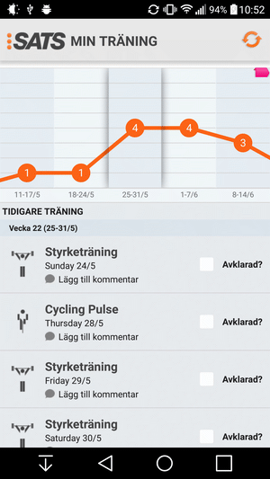
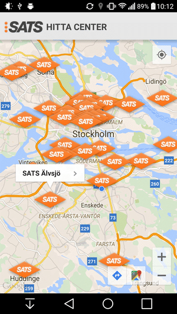
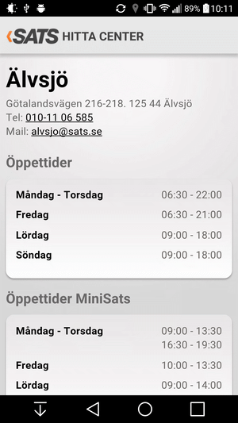
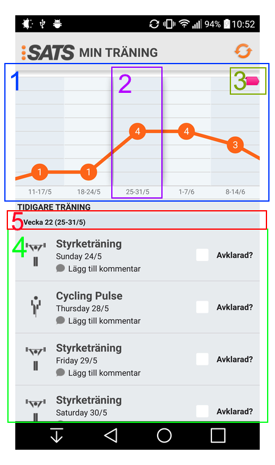

## About The Project
A partial replication of the official SATS ELIXIA training app (that can be found on [the Google Play store](https://play.google.com/store/apps/details?id=com.sats.sats)). 

It was made during a six week SCRUM project, and is based on design documents and functional requirements that were provided by the developers of the original application, [Apegroup](http://apegroup.com/).

## My Main Contributions

* Researched and implemented the functionality of the list views of the calendar view.

_[Scroll down](#calendar-overview) to see a detailed overview of the of the calendar view._

## Screenshots

The workout calendar view.

A map view that shows the locations of SATS training centers.

A webview that shows details on a specific SATS training center

## Calendar Overview

1. A horizontally scrollable and clickable list(actually a [ViewPager](http://developer.android.com/reference/android/support/v4/view/ViewPager.html)). It shows the number of activities of each week, and draws a graph. Clicking on this list scrolls it so the clicked item is in the center, and scrolls the lower list to show the selected week.
2. The week that is shown in the list below, with number of activities(4), and dates for the week (25/5-31/5). 
3. Click on this pink marker to scroll to the current week.
4. A veritcally scrollable list showing all activities for all weeks.
5. A sticky list header(scrolls with the list), that shows to what week the activities below it belong.

## Calendar Implementation Details
_coming soon?_